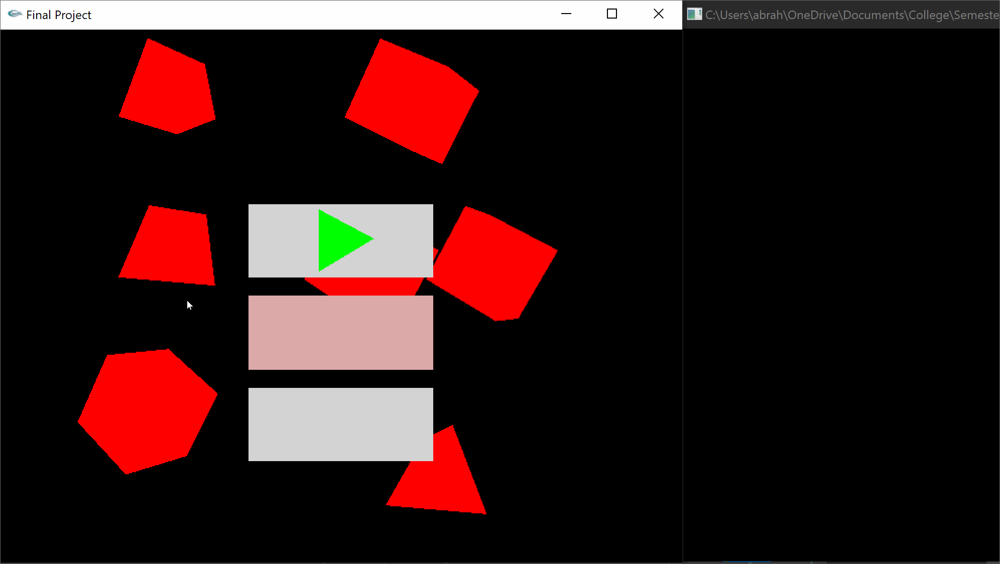
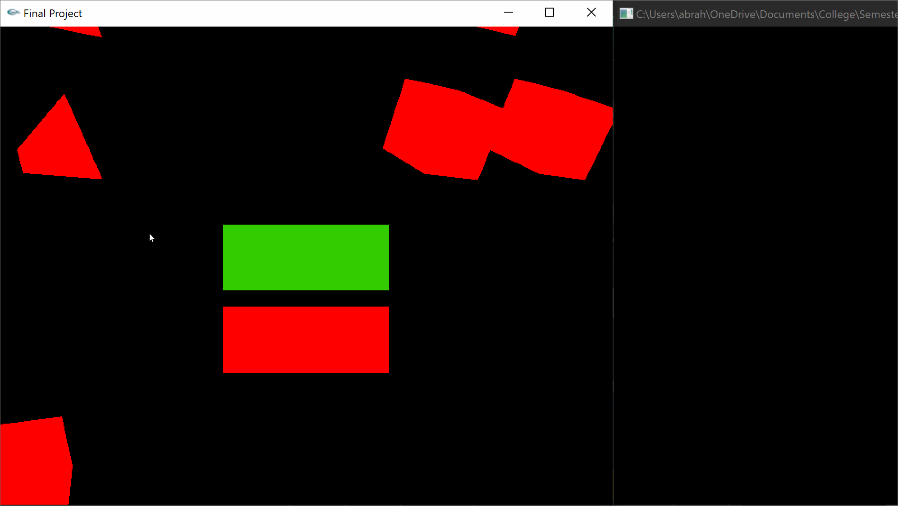
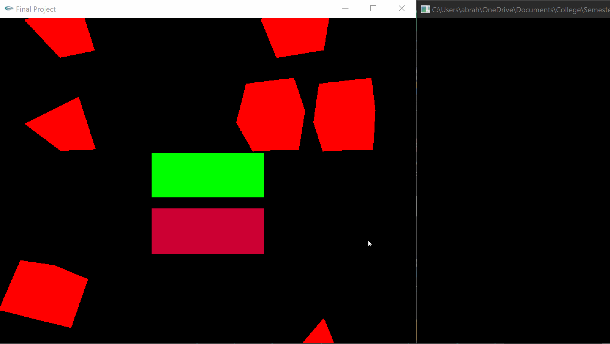

# Color-Shape-Mach-Game

This game tests your memory skills by flashing different colored shapes and requesting you to recall the order they were flashed at. There are two difficulty modes:
Easy (green) and Hard (red).

Installation
--------------

- Download finalProject.cpp and finalProject.exe
- Must install glut32.dll for code to run
- Run finalProject.exe

Controls
--------------

Keys:
- Esc: Close Application
- UpKey: Menu->navigate up, In-Game->Change color
- DownKey: Menu->navigate down, In-Game->Change color
- LeftKey: In-Game->Change shape
- RightKey: In-Game->Change shape
- Enter: Menu->select/advance, In-Game->submit answer
- Backspace: Go back to previous screen
- MouseClick&Drag: MainMenu->rotate shapes in the background

How to Play
--------------

Easy Mode:
The user is to remember the order the colors are flashed. In the first stage, only one color will be flashed. Recall it correctly (using the up/down arrow keys) and you'll advance to stage 2, where two colors will be presented sequentially. Recall them in order again to advance to the next stage. One new color will alaways be added in each upcoming stage.

Hard Mode:

The user is to remember the order the shapes are flashed while also remembering their color. In the first stage, only one colored shape will be flashed. Recall it correctly (using the up/down/left/right arrow keys) and you'll advance to stage 2, where two colored shapes will be presented sequentially. Recall them in order again to advance to the next stage. One new colored shape will alaways be added in each upcoming stage.

Technologies Used
--------------
1. C++
2. OpenGL
3. Glut

